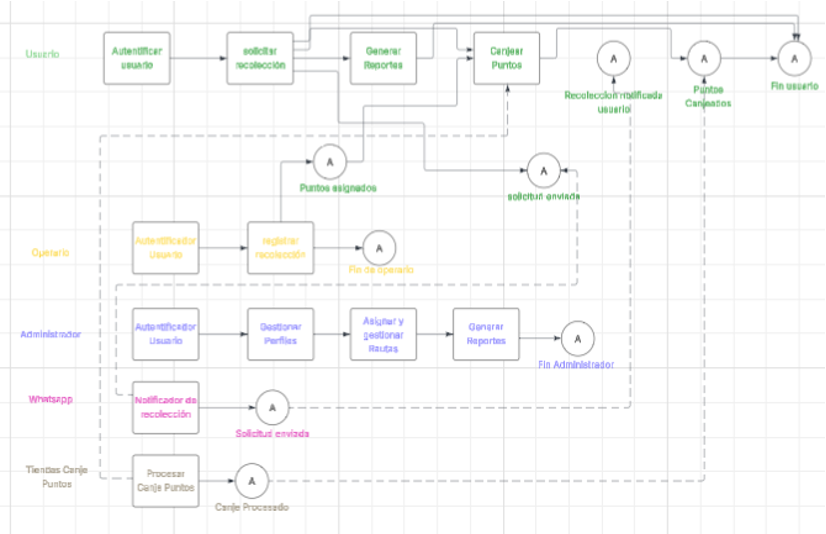
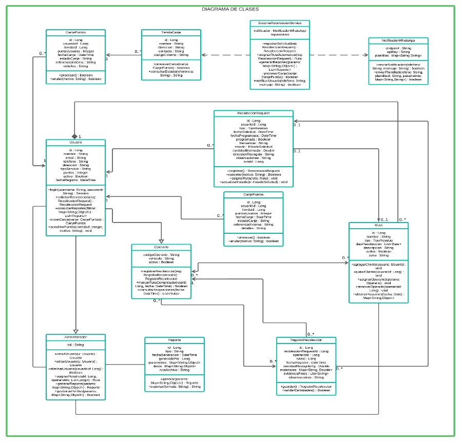

# sistema_de_recoleccion

Proyecto para la materia: Ingeniería de Software I
Institución: Politécnico Grancolombiano

Equipo:
-------

```
Sebastián Valencia Sierra
Diego Alexander Rozo Vargas
Laura Sofía Castellanos Manrique
Julio Cesar Cárdenas Rodríguez
```

Tabla de contenido
------------------

- [Descripción del proyecto](#descripción-del-proyecto)
- [Requerimientos funcionales](#requerimientos-funcionales)
- [Requerimientos no funcionales](#requerimientos-no-funcionales)
- [Casos de uso](#casos-de-uso)
- [Diagrama de Clases](#diagrama-de-clases)
- [Estructura del proyecto](#estructura-del-proyecto)
- [Funcionalidades implementadas (MVP actual)](#funcionalidades-implementadas-mvp-actual)
- [Notas de autorización](#notas-de-autorización)
- [Visualización e interfaz](#visualización-e-interfaz)
- [Reportes (CSV)](#reportes-csv)
- [Requisitos (desarrollo)](#requisitos-desarrollo)
- [Instalación y ejecución (macOS)](#macos)
- [Instalación y ejecución (Windows)](#windows-powershell--cmd)
- [Tests](#tests)
- [Git](#git)
- [Contribución y licencia](#contribución-y-licencia)

Descripción del proyecto
------------------------

Aplicación web que permite dar soporte a los procesos que se desarrollan en una empresa de recolección de residuos domésticos, es un servicio diferente al de recolección de basura de la ciudad que busca reducir la cantidad de desechos que van a los rellenos sanitarios. Los usuarios acceden al servicio mediante una suscripción gratuita y voluntaria, y deben seguir pautas adecuadas para la separación, limpieza y entrega de los residuos. Los residuos que recolecta la empresa están categorizados en:

1. Residuos orgánicos que se producen en el hogar (Fracción orgánica, Fracción vegetal y residuos de poda).
2. Residuos inorgánicos reciclables (papel y cartón, plásticos, vidrio y metales limpios).
3. Residuos peligrosos (baterías, aceites usados, etc.), manejados por empresas especializadas.

El sistema debe soportar el registro de solicitudes de recolección (programadas o por demanda), el registro de kilos entregados por recolección, notificaciones por WhatsApp (registro, día anterior y día de la recolección con número de turno), acumulación de puntos por recolección, canje de puntos y generación de reportes por usuario, localidad y empresa recolectora.

Requerimientos funcionales
--------------------------

Los requerimientos funcionales (RF) principales son:

- RF1: El sistema debe permitir a los administradores visualizar, registrar, editar y eliminar clientes (nombre, dirección, teléfono y tipo de servicio contratado).
- RF2: El sistema debe permitir a los administradores crear y asignar rutas de recolección a los operarios.
- RF3: El sistema debe mostrar un calendario con las recolecciones programadas por ruta y fecha.
- RF4: El sistema debe permitir a los operarios marcar la ruta de recolección como completada desde un dispositivo móvil o panel de control.
- RF5: El sistema debe generar reportes semanales y mensuales sobre lo recolectado por cada operador.
- RF6: El sistema debe implementar autenticación para operarios y administradores.
- RF7: El sistema debe manejar perfiles con roles (administrador, operario) y restricciones de acceso según rol.

Requerimientos no funcionales
----------------------------

Resumen de aspectos no funcionales importantes:

- Usabilidad: interfaz intuitiva y procedimientos de registro de recolección en máximo 3 pasos.
- Rendimiento: tiempos de carga y respuesta máximos definidos (p.ej. <3s para páginas, <2s para consultas simples).
- Seguridad: autenticación segura, control de acceso por roles, cifrado y protección contra inyección SQL y ataques de fuerza bruta.
- Disponibilidad: nivel objetivo de disponibilidad del 99.5% y tolerancia a fallos.
- Escalabilidad: soporte para crecimiento en usuarios, rutas y empresas recolectoras.
- Mantenibilidad: código modular y documentado, fácil de extender.
- Compatibilidad: soporte para navegadores modernos y dispositivos móviles.

Casos de uso
-----------------------

Actores identificados:

- Administrador: gestiona clientes, operarios, rutas y reportes.
- Operario: realiza recolecciones, marca rutas completadas y registra cantidades.
- Usuario (cliente): solicita recolecciones, recibe notificaciones, acumula puntos y consulta reportes.
- Sistema externo (WhatsApp): envío de notificaciones.
- Sistema externo (Tiendas colaboradoras): canje de puntos.
- Empresa recolectora: su interacción se gestiona vía administradores/operarios para asignación y gestión de rutas.

Casos de uso principales:

- CU1 — Autenticar Usuario (RF6)
	- Actor(es): Administrador, Operario, Usuario.
	- Descripción: Inicio de sesión con credenciales válidas.
	- Precondición: Usuario registrado con credenciales.
	- Flujo principal: acceder a login → ingresar credenciales → validadas por el sistema → redirección al panel según rol.
	- Flujos alternativos: credenciales inválidas → mensaje de error / opción recuperar password.
	- Postcondición: sesión iniciada o error comunicado.

- CU2 — Gestionar Perfiles de Usuario (RF1, RF7, RF11)
	- Actor: Administrador.
	- Descripción: Crear, ver, editar y eliminar perfiles (clientes/profes, operarios, admins) y sus datos (nombre, dirección, teléfono, tipo de servicio).
	- Precondición: Administrador autenticado.
	- Flujo principal: acceder a gestión de usuarios → listar → crear/editar/eliminar/visualizar detalles → validar y guardar cambios.
	- Flujos alternativos: datos inválidos al guardar; confirmación de eliminación cancelada.
	- Postcondición: datos de usuarios actualizados en el sistema.

- CU3 — Solicitar Recolección (RF4 y RF5 parte)
	- Actor: Usuario.
	- Descripción: Solicitar recolección de inorgánicos (programada o por demanda) o peligrosos (mensual). Los orgánicos se asignan por localidad semanalmente.
	- Precondición: Usuario autenticado.
	- Flujo principal: seleccionar tipo de residuo → elegir opción (programada/por demanda) → seleccionar frecuencia/día o fecha disponible → registrar solicitud.
	- Flujos alternativos: fechas no disponibles; solicitud duplicada.
	- Postcondición: solicitud registrada en el sistema.

- CU4 — Asignar y Gestionar Rutas de Recolección (RF2)
	- Actor: Administrador.
	- Descripción: Crear, modificar y asignar rutas (clientes/localidades, operarios) y programaciones (días fijos o franjas horarias).
	- Precondición: Administrador autenticado; clientes y operarios registrados.
	- Flujo principal: acceder a sección de rutas → crear/editar/asignar rutas → guardar y notificar a operarios según corresponda.
	- Flujos alternativos: conflictos de programación o recursos insuficientes.
	- Postcondición: rutas actualizadas y asignadas.




Diagrama de Clases
------------------


Estructura del proyecto
-----------------------

A continuación una guía rápida de las carpetas y archivos más importantes del proyecto con enlaces corregidos (apuntan a la subcarpeta `sistema_de_recoleccion/` donde reside la app en este repositorio):

- `sistema_de_recoleccion/app/` — Código principal de la aplicación (controladores, modelos, policies, comandos de consola, notificaciones).
	- `sistema_de_recoleccion/app/Http/Controllers/` — controladores HTTP (ej.: `DashboardController.php`, `CollectionController.php`, `ReportController.php`).
	- `sistema_de_recoleccion/app/Models/` — modelos Eloquent (`User.php`, `Collection.php`).
	- `sistema_de_recoleccion/app/Policies/` — políticas de autorización (`CollectionPolicy.php`).
	- `sistema_de_recoleccion/app/Console/Commands/` — comandos artisan (ej.: `CleanOldReports.php`).
	- `sistema_de_recoleccion/app/Notifications/` — notificaciones (ej.: `CollectionCancelled.php`).

- `sistema_de_recoleccion/routes/` — definición de rutas web y de consola:
	- `sistema_de_recoleccion/routes/web.php` — rutas accesibles por el navegador (dashboard, collections, reports, auth).

- `sistema_de_recoleccion/resources/views/` — vistas Blade (UI):
	- `sistema_de_recoleccion/resources/views/layouts/` — plantillas globales (p. ej. `navigation.blade.php`, `app.blade.php`).
	- `sistema_de_recoleccion/resources/views/collections/` — vistas para la funcionalidad de recolecciones (index, create, edit, show).
	- `sistema_de_recoleccion/resources/views/reports/` — vistas de reportes (ej.: `index.blade.php`).
	- `sistema_de_recoleccion/resources/views/dashboard.blade.php` — vista del panel principal del usuario.

- `sistema_de_recoleccion/database/` — migraciones, factories y seeders:
	- `sistema_de_recoleccion/database/migrations/2025_10_04_000100_create_collections_table.php` — migración para la tabla `collections`.
	- `sistema_de_recoleccion/database/migrations/2025_10_04_100000_add_role_to_users.php` — migración que añadió el campo `role` a `users`.
	- `sistema_de_recoleccion/database/factories/CollectionFactory.php` — fábrica para `Collection` usada en tests.
	- `sistema_de_recoleccion/database/database.sqlite` — archivo SQLite (si lo estás usando en desarrollo).

- `sistema_de_recoleccion/public/` — archivos públicos y assets compilados por Vite.

- `sistema_de_recoleccion/resources/js/` y `sistema_de_recoleccion/resources/css/` — entrada de JavaScript y CSS (Vite + Tailwind).

- `storage/app/reports/` — carpeta donde se guardan los CSV generados por cada usuario (asegúrate de crearla y darle permisos de escritura en desarrollo).

- `sistema_de_recoleccion/tests/` — pruebas PHPUnit:
	- `sistema_de_recoleccion/tests/Feature/CancelCollectionTest.php` — pruebas de cancelación de recolecciones.
	- `sistema_de_recoleccion/tests/Feature/CollectionValidationTest.php` — pruebas de validación de formularios.

Enlaces rápidos (desde la raíz del repo):

- [routes/web.php](sistema_de_recoleccion/routes/web.php)
- [app/Models/Collection.php](sistema_de_recoleccion/app/Models/Collection.php)
- [app/Http/Controllers/CollectionController.php](sistema_de_recoleccion/app/Http/Controllers/CollectionController.php)
- [app/Http/Controllers/ReportController.php](sistema_de_recoleccion/app/Http/Controllers/ReportController.php)
- [app/Policies/CollectionPolicy.php](sistema_de_recoleccion/app/Policies/CollectionPolicy.php)
- [app/Console/Commands/CleanOldReports.php](sistema_de_recoleccion/app/Console/Commands/CleanOldReports.php)
- [app/Notifications/CollectionCancelled.php](sistema_de_recoleccion/app/Notifications/CollectionCancelled.php)
- [resources/views/collections/index.blade.php](sistema_de_recoleccion/resources/views/collections/index.blade.php)
- [resources/views/reports/index.blade.php](sistema_de_recoleccion/resources/views/reports/index.blade.php)
- [resources/views/dashboard.blade.php](sistema_de_recoleccion/resources/views/dashboard.blade.php)
- [database/migrations/2025_10_04_000100_create_collections_table.php](sistema_de_recoleccion/database/migrations/2025_10_04_000100_create_collections_table.php)
- [database/migrations/2025_10_04_100000_add_role_to_users.php](sistema_de_recoleccion/database/migrations/2025_10_04_100000_add_role_to_users.php)
- [database/factories/CollectionFactory.php](sistema_de_recoleccion/database/factories/CollectionFactory.php)
- [tests/Feature/CancelCollectionTest.php](sistema_de_recoleccion/tests/Feature/CancelCollectionTest.php)
- [tests/Feature/CollectionValidationTest.php](sistema_de_recoleccion/tests/Feature/CollectionValidationTest.php)


Funcionalidades implementadas (MVP actual)
-----------------------------------------

A continuación se describen las funcionalidades y rutas que ya están implementadas en este repositorio como parte del MVP mínimo entregable. Incluye el sistema de autenticación (Breeze), gestión básica de "recolecciones" por usuario y un panel (dashboard) resumen.

Descripción general
- Autenticación: registro, inicio de sesión y gestión de perfil (Breeze - Blade).
- Programación de recolecciones: los usuarios autenticados pueden crear solicitudes de recolección (tipo, fecha/frecuencia, kilos estimados, notas) y ver su historial.
- Dashboard de usuario: resumen con totales y últimas recolecciones del usuario autenticado.
- Navegación: enlace al dashboard, sección "Mis recolecciones", botón "+ Programar Nueva Recolección" y enlace a configuración/perfil. También se añadió un título apilado "Proyecto / Gestión de Recursos" que enlaza al dashboard.

Rutas y qué permiten
Las rutas principales creadas y su comportamiento son:

- GET /dashboard
	- Controlador: `DashboardController@index`
	- Requiere autenticación.
	- Muestra un resumen del usuario: totales (recolecciones, kilos), y una lista de las recolecciones recientes.

- Resource routes para `collections` (registradas en `routes/web.php` como `Route::resource('collections', CollectionController::class)` dentro de `auth`):
	- GET  /collections -> `CollectionController@index` — lista de recolecciones del usuario.
	- GET  /collections/create -> `CollectionController@create` — formulario para programar una nueva recolección.
	- POST /collections -> `CollectionController@store` — crea una recolección validada.
	- GET  /collections/{collection} -> `CollectionController@show` — detalles de una recolección.
	- GET  /collections/{collection}/edit -> `CollectionController@edit` — formulario para editar (autorización: propietario o admin).
	- PUT/PATCH /collections/{collection} -> `CollectionController@update` — actualiza la recolección (autorización: propietario o admin).
	- DELETE /collections/{collection} -> `CollectionController@destroy` — elimina la recolección (autorización: propietario o admin).

- GET /profile (perfil de usuario)
	- Viene de los scaffolds de Breeze: permite editar nombre/email/contraseña.

- POST /logout
	- Cierra sesión del usuario autenticado.

Notas de autorización
---------------------

- Todas las rutas relacionadas con `collections` y el `dashboard` están protegidas por middleware `auth`.
- Existe una `CollectionPolicy` que restringe acciones sensibles (editar/eliminar/ver) al propietario de la recolección o a un usuario con rol admin. (Actualmente el chequeo de rol `hasRole('admin')` está preparado en la policy; si deseas, puedo añadir un campo `role` al modelo `User` y el helper `hasRole()` para completar la lógica).

Visualización e interfaz
------------------------
- Barra superior (desktop): color verde (#16a34a) con el logo a la izquierda. Junto al logo aparece el título apilado "Proyecto" / "Gestión de Recursos" que enlaza al dashboard. A la derecha están los enlaces de navegación: Inicio (Dashboard), Mis recolecciones, + Programar Nueva Recolección y Configuración. El menú de usuario incluye nombre y opción de cierre de sesión.
- Responsive (móvil): la navegación se colapsa en un botón "hamburger"; al abrirse muestra el título del proyecto en la parte superior del menú y los mismos enlaces (Inicio, Mis recolecciones, + Programar, Configuración). Se añadieron estilos inline para asegurar contraste aun si los assets de Tailwind no se compilan.
- Dashboard: tarjetas resumen con totales y una lista de recolecciones recientes; botones rápidos para crear nueva recolección y editar perfil.
- Formularios de recolección: campos típicos (tipo, modo, frecuencia/fecha, kilos estimados, notas). En el backend se validan las entradas antes de guardar.

Reportes (CSV)
----------------

Se ha añadido una funcionalidad básica de reportes que permite a cada usuario generar un CSV con sus recolecciones y descargarlo desde la interfaz.

- Rutas principales:
	- GET  /reports -> `ReportController@index` (lista reportes generados y botón para crear uno nuevo). Ruta protegida por `auth`.
	- POST /reports -> `ReportController@store` (genera un CSV con todas las recolecciones del usuario y lo guarda en `storage/app/reports`). Ruta protegida por `auth`.
	- GET  /reports/download/{filename} -> `ReportController@download` (descarga el CSV). Ruta protegida por `auth`.

- Ubicación de los archivos generados:
	- Los CSV se guardan en `storage/app/reports/` y pueden descargarse desde la vista de reportes.
	- Asegúrate de que la carpeta `storage/app/reports` exista y tenga permisos de escritura por el usuario de la aplicación (ej.: `mkdir -p storage/app/reports && chmod -R 775 storage/app/reports`).

- Qué contiene el CSV generado:
	- Columnas (encabezados en el CSV): `id,tipo,modo,frecuencia,programado_en,kilos,estado,notas,creado_en`.
	- Los CSV ahora exportan las etiquetas en español para `tipo` y `estado` (por ejemplo `Orgánico`, `Programada`, `Cancelada`).

- Interacción en la interfaz:
	- Se añadió un enlace "Reportes" en la navegación principal. Al acceder verás la lista de reportes disponibles y un botón "Generar nuevo reporte".
	- Al generar un reporte, el servidor lo crea y la vista de reportes lo listará para su descarga.

- Prueba rápida (local):
	1. Arranca la app: `php artisan serve`.
	2. Inicia sesión con un usuario de prueba.
	3. Visita `Dashboard` → `Reportes` o directamente `http://127.0.0.1:8000/reports`.
	4. Haz clic en "Generar nuevo reporte" y luego en "Descargar" para obtener el CSV.

Ejemplo de CSV generado
-----------------------

Ejemplo de cómo se verá el CSV generado (primera fila con encabezados y una fila de ejemplo):

```
id,tipo,modo,frecuencia,programado_en,kilos,estado,notas,creado_en
123,Orgánico,Programada,2,2025-10-07 08:00,12.5,Programada,"Entrega en portería",2025-10-01 10:23:45
```

 
Archivos relevantes (dónde mirar el código)
-------------------------------------------

- Rutas: [routes/web.php](sistema_de_recoleccion/routes/web.php)
- Controladores: [app/Http/Controllers/DashboardController.php](sistema_de_recoleccion/app/Http/Controllers/DashboardController.php), [app/Http/Controllers/CollectionController.php](sistema_de_recoleccion/app/Http/Controllers/CollectionController.php)
- Modelos: [app/Models/Collection.php](sistema_de_recoleccion/app/Models/Collection.php), [app/Models/User.php](sistema_de_recoleccion/app/Models/User.php) (relación collections)
- Policies: [app/Policies/CollectionPolicy.php](sistema_de_recoleccion/app/Policies/CollectionPolicy.php)
- Migraciones: [database/migrations/2025_10_04_000100_create_collections_table.php](sistema_de_recoleccion/database/migrations/2025_10_04_000100_create_collections_table.php) (y otras migraciones agregadas)
- Vistas (Blade):
	- [resources/views/dashboard.blade.php](sistema_de_recoleccion/resources/views/dashboard.blade.php) — panel de usuario
	- [resources/views/collections/](sistema_de_recoleccion/resources/views/collections/) — index, create, show, edit
	- [resources/views/layouts/navigation.blade.php](sistema_de_recoleccion/resources/views/layouts/navigation.blade.php) — cabecera y navegación (título apilado añadido)

- Reportes CSV mejorados
	- Los CSV ahora se generan con encabezados y etiquetas en español (por ejemplo `tipo`, `estado`) y los valores `type`/`status` se exportan como `Orgánico`/`Programada`/`Cancelada`, etc.
	- Los archivos generados se guardan con prefijo por usuario: `user_{id}_report_collections_YYYYMMDD_HHMMSS.csv`. Esto garantiza que cada usuario vea y pueda eliminar únicamente sus reportes.
	- En la interfaz `Reportes` se muestra la lista de reportes del usuario, botón para generar nuevo CSV, descargar y (si el fichero pertenece al usuario) eliminar.

- Eliminación de reportes
	- Se añadió un botón "Eliminar" en `resources/views/reports/index.blade.php`. La eliminación está restringida al propietario del fichero (según el prefijo `user_{id}_`).

- Limpieza automática/manual de reportes antiguos
	- Nuevo comando Artisan: `php artisan reports:clean {--days=30}` que borra reportes en `storage/app/reports` con una antigüedad mayor a N días.
	- Ejemplo: `php artisan reports:clean --days=90` eliminará reportes con más de 90 días.

- Rol de administrador y helper `hasRole()`
	- Se agregó una migración para añadir la columna `role` en la tabla `users` y un helper `User::hasRole(string $role)` en el modelo `User`.
	- Las policies (por ejemplo `CollectionPolicy`) usan este helper para permitir acciones administrativas (editar/eliminar/ver).

- Cancelación de recolecciones (UX + notificaciones)
	- Se añadió la acción "Cancelar Recolección" en `Mis recolecciones` (visible solo para el propietario o admin y solo si el estado es `Programada`).
	- La confirmación usa un modal ligero en la interfaz en lugar de `confirm()` para una mejor experiencia.
	- Cuando se cancela una recolección, se notifica por correo a los usuarios con `role = 'admin'` mediante la notification `CollectionCancelled`.

- Validaciones de formulario
	- En el formulario `Solicitar Recolección` (`resources/views/collections/create.blade.php`) los campos `frequency` y `scheduled_at` son ahora obligatorios tanto en el frontend (atributo `required`) como en el backend (reglas `required|integer|min:1` y `required|date` en `CollectionController`).

- Tests y factories
	- Se añadieron pruebas de PHPUnit que cubren la lógica de cancelación y la validación del formulario:
		- `tests/Feature/CancelCollectionTest.php` — propietario puede cancelar, no propietario no puede, no se puede cancelar si no está programada.
		- `tests/Feature/CollectionValidationTest.php` — valida que `frequency` y `scheduled_at` son obligatorios al crear.
	- Se añadió `database/factories/CollectionFactory.php` para facilitar la creación de datos en tests.

Notas de implementación y seguridad
----------------------------------
- Los reportes se almacenan en `storage/app/reports`; asegúrate de que el directorio exista y sea escribible por la app.
- La lógica de autorización usa `CollectionPolicy` y el helper `User::hasRole`. Si prefieres otro esquema de roles (p. ej. paquetes ACL), puedo migrar esa lógica.
- La notificación por correo usa el mailer configurado (`MAIL_MAILER`); en desarrollo por defecto se usa `log` para no enviar emails reales.

Pruebas y comprobaciones rápidas
- Para verificar la funcionalidad localmente: crea un usuario (registro), accede a la sección "Mis recolecciones" y prueba crear/editar/ver una recolección. Comprueba que el dashboard muestre las recolecciones y que el enlace del título del proyecto lleva al dashboard.


Requisitos (desarrollo)
-----------------------
- PHP >= 8.2
- Composer
- Node 16/18/20+ y npm
- Git


Instalar prerequisitos (macOS y Windows)
----------------------------------------
Abajo encontrarás comandos para instalar las herramientas necesarias en macOS (con Homebrew) y Windows (PowerShell con Chocolatey). Estas instrucciones están pensadas para entornos de desarrollo locales.

macOS (Homebrew)
```bash
# 1) Instala Homebrew (si no lo tienes):
/bin/bash -c "$(curl -fsSL https://raw.githubusercontent.com/Homebrew/install/HEAD/install.sh)"

# 2) Instala PHP, Composer y Git
brew update
brew install php@8.2
brew link --force --overwrite php@8.2
php -v

# Composer
curl -sS https://getcomposer.org/installer | php
mv composer.phar /usr/local/bin/composer
composer --version

# Git (si no lo tienes)
brew install git

# 3) Instala Node.js (recomendado: nvm para gestionar versiones)
curl -o- https://raw.githubusercontent.com/nvm-sh/nvm/v0.39.4/install.sh | bash
export NVM_DIR="$HOME/.nvm"
[ -s "$NVM_DIR/nvm.sh" ] && \. "$NVM_DIR/nvm.sh"
nvm install 18
nvm use 18
node -v
npm -v
```

Windows (PowerShell + Chocolatey)
```powershell
# Ejecutar PowerShell como Administrador

# 1) Instala Chocolatey (si no lo tienes):
Set-ExecutionPolicy Bypass -Scope Process -Force; 
[System.Net.ServicePointManager]::SecurityProtocol = [System.Net.ServicePointManager]::SecurityProtocol -bor 3072; 
iwr https://community.chocolatey.org/install.ps1 -UseBasicParsing | iex

# 2) Instala PHP, Composer y Git
choco install php --version=8.2 -y
refreshenv
php -v

# Composer
choco install composer -y
refreshenv
composer --version

# Git
choco install git -y

# 3) Instala Node.js (recomendado: nvm-windows)
choco install nvm -y
refreshenv
# Reinicia la terminal para que nvm esté disponible
nvm install 18.17.1
nvm use 18.17.1
node -v
npm -v
```


## Instalación y ejecución (macOS)

```bash
# Sitúate en la raíz del proyecto (donde está artisan)
cd /ruta/al/codigoFuente/sistema_de_recoleccion/sistema_de_recoleccion

# 1) Instala dependencias PHP
composer install

# 2) Instala dependencias JS
npm install

# 3) Crea la base de datos SQLite (si usas SQLite)
touch database/database.sqlite
chmod 664 database/database.sqlite

# 4) Copia .env y genera APP_KEY (si aún no existe)
cp .env.example .env
php artisan key:generate

# 5) Ajustes opcionales en .env
# - Por defecto este proyecto usa SQLite: DB_CONNECTION=sqlite
# - SESSION_DRIVER=database está activo en desarrollo (tabla sessions creada)
#   Si prefieres sesiones en fichero, cambia a: SESSION_DRIVER=file

# 6) Ejecuta migraciones
php artisan migrate

# 7) Compila assets (Vite)
npm run dev   # en desarrollo (mantén la terminal abierta)
# o para producción:
npm run build

# 8) Levanta el servidor local
php artisan serve
# Abre http://127.0.0.1:8000

# 9) Ejecutar tests
php artisan test
```

## Instalación y ejecución (Windows)

Si trabajas en Windows, aquí tienes los comandos equivalentes. Usa PowerShell para la mayoría de los comandos; para CMD reemplaza las construcciones de PowerShell con sus equivalentes (hay ejemplos debajo).

PowerShell (recomendado):
```powershell
# Sitúate en la raíz del proyecto (ajusta la ruta a tu entorno)
Set-Location -Path "C:\ruta\a\tu\proyecto\sistema_de_recoleccion"

# 1) Instala dependencias PHP (Composer debe estar en PATH)
composer install

# 2) Instala dependencias JS
npm install

# 3) Crea la base de datos SQLite
New-Item -Path database\database.sqlite -ItemType File -Force

# 4) Copia .env y genera APP_KEY
Copy-Item -Path .env.example -Destination .env -Force
php artisan key:generate

# 5) Ejecuta migraciones
php artisan migrate

# 6) Compila assets
npm run dev

# 7) Levanta el servidor
php artisan serve

# 8) Ejecutar tests
php artisan test
```

## Configurar el archivo .env

Antes de ejecutar la aplicación, cada desarrollador debe crear y configurar su propio archivo de entorno `.env`. A continuación hay pasos y ejemplos para hacerlo de forma segura y reproducible.

1) Copiar el ejemplo y generar la APP_KEY

```bash
cp .env.example .env
php artisan key:generate
```

2) Base de datos: SQLite (recomendado para desarrollo)

Por simplicidad el proyecto usa SQLite por defecto. Crea el archivo y dale permisos:

```bash
touch database/database.sqlite
chmod 664 database/database.sqlite
# Asegúrate de que en tu .env esté:
DB_CONNECTION=sqlite
# y que DB_DATABASE apunte a database/database.sqlite o esté vacío si usas la configuración por defecto
```

### Notas para usuarios de Windows

Si trabajas en Windows, aquí tienes los comandos equivalentes para crear el archivo SQLite y preparar el `.env`:

PowerShell (recomendado):

```powershell
# Copiar .env y generar APP_KEY
Copy-Item -Path .env.example -Destination .env -Force
php artisan key:generate

# Crear archivo SQLite
New-Item -Path database\database.sqlite -ItemType File -Force
# No es necesario chmod en Windows

# Asegúrate en .env:
# DB_CONNECTION=sqlite
```

CMD (símbolo del sistema):

```cmd
copy .env.example .env
php artisan key:generate

type nul > database\database.sqlite
```

3) Drivers de sesión/cache/queue

Para desarrollo recomendamos:

```env
SESSION_DRIVER=file
CACHE_DRIVER=file
QUEUE_CONNECTION=sync
```

Si prefieres sesiones en base de datos:

```bash
php artisan session:table
php artisan migrate
```

5) Mail (desarrollo)

Para no depender de un servicio externo en desarrollo, usa el driver `log` o `mailtrap`:

```env
MAIL_MAILER=log
MAIL_FROM_ADDRESS=no-reply@example.com
MAIL_FROM_NAME="Proyecto Gestión de Recursos"
```

6) Archivos públicos y permisos

Si la app necesita servir archivos almacenados, crea el enlace simbólico de storage:

```bash
php artisan storage:link
```

7) Variables útiles y URL

```env
APP_URL=http://127.0.0.1:8000
VITE_DEV_SERVER_URL=http://127.0.0.1:5173
FILESYSTEM_DISK=public
```

8) Ejecutar migraciones y semillas

```bash
php artisan migrate --seed
```

9) Errores comunes y soluciones rápidas
- Si ves `SQLSTATE` o "no se encuentra la base", revisa `DB_CONNECTION` y la ruta a `database/database.sqlite`.
- Si el botón o estilos no se ven correctamente, ejecuta `npm install` y `npm run dev` y limpia vistas con `php artisan view:clear`.
- Si `php artisan migrate` falla por permisos, revisa permisos del directorio `database` y `storage`.

Si alguno de tus compañeros sigue teniendo problemas, pídeles que compartan el error exacto (stack trace) y con gusto lo reviso.


## Tests

Para ejecutar la suite de pruebas del proyecto (unitarias y funcionales) desde la raíz del proyecto:

```bash
php artisan test
```

## Git

Comandos básicos recomendados para versionar los cambios:

```bash
git add -A
git commit -m "Install Breeze (auth scaffolding) and add safe sessions migration"
git push origin <tu-rama>
```

## About Laravel

Laravel is a web application framework with expressive, elegant syntax. We believe development must be an enjoyable and creative experience to be truly fulfilling. Laravel takes the pain out of development by easing common tasks used in many web projects, such as:

- [Simple, fast routing engine](https://laravel.com/docs/routing).
- [Powerful dependency injection container](https://laravel.com/docs/container).
- Multiple back-ends for [session](https://laravel.com/docs/session) and [cache](https://laravel.com/docs/cache) storage.
- Expressive, intuitive [database ORM](https://laravel.com/docs/eloquent).
- Database agnostic [schema migrations](https://laravel.com/docs/migrations).
- [Robust background job processing](https://laravel.com/docs/queues).
- [Real-time event broadcasting](https://laravel.com/docs/broadcasting).

Laravel is accessible, powerful, and provides tools required for large, robust applications.

## Learning Laravel

Laravel has the most extensive and thorough [documentation](https://laravel.com/docs) and video tutorial library of all modern web application frameworks, making it a breeze to get started with the framework.

You may also try the [Laravel Bootcamp](https://bootcamp.laravel.com), where you will be guided through building a modern Laravel application from scratch.

If you don't feel like reading, [Laracasts](https://laracasts.com) can help. Laracasts contains thousands of video tutorials on a range of topics including Laravel, modern PHP, unit testing, and JavaScript. Boost your skills by digging into our comprehensive video library.

## Laravel Sponsors

We would like to extend our thanks to the following sponsors for funding Laravel development. If you are interested in becoming a sponsor, please visit the [Laravel Partners program](https://partners.laravel.com).

### Premium Partners

- **[Vehikl](https://vehikl.com)**
- **[Tighten Co.](https://tighten.co)**
- **[Kirschbaum Development Group](https://kirschbaumdevelopment.com)**
- **[64 Robots](https://64robots.com)**
- **[Curotec](https://www.curotec.com/services/technologies/laravel)**
- **[DevSquad](https://devsquad.com/hire-laravel-developers)**
- **[Redberry](https://redberry.international/laravel-development)**
- **[Active Logic](https://activelogic.com)**

## Contributing

Thank you for considering contributing to the Laravel framework! The contribution guide can be found in the [Laravel documentation](https://laravel.com/docs/contributions).

## Code of Conduct

In order to ensure that the Laravel community is welcoming to all, please review and abide by the [Code of Conduct](https://laravel.com/docs/contributions#code-of-conduct).

## Security Vulnerabilities

If you discover a security vulnerability within Laravel, please send an e-mail to Taylor Otwell via [taylor@laravel.com](mailto:taylor@laravel.com). All security vulnerabilities will be promptly addressed.

## License

The Laravel framework is open-sourced software licensed under the [MIT license](https://opensource.org/licenses/MIT).
