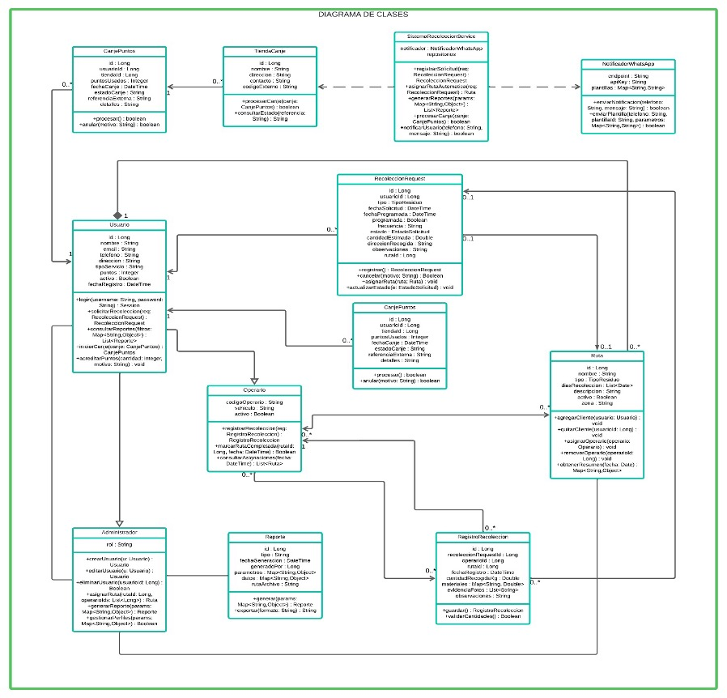

# sistema_de_recoleccion

Proyecto para la materia: Ingeniería de Software I
Institución: Politécnico Grancolombiano

Equipo:

```
Sebastián Valencia Sierra
Diego Alexander Rozo Vargas
Laura Sofía Castellanos Manrique
Julio Cesar Cárdenas Rodríguez
```

Tabla de contenido
- [Descripción del proyecto](#descripción-del-proyecto)
- [Requerimientos funcionales](#requerimientos-funcionales)
- [Requerimientos no funcionales](#requerimientos-no-funcionales)
- [Casos de uso](#casos-de-uso)
- [Requisitos (desarrollo)](#requisitos-desarrollo)
- [Instalación y ejecución (macOS)](#macos)
- [Instalación y ejecución (Windows)](#windows-powershell--cmd)
- [Tests](#tests)
- [Git](#git)
- [Contribución y licencia](#contribución-y-licencia)

Descripción del proyecto
------------------------

Aplicación web que permite dar soporte a los procesos que se desarrollan en una empresa de recolección de residuos domésticos, es un servicio diferente al de recolección de basura de la ciudad que busca reducir la cantidad de desechos que van a los rellenos sanitarios. Los usuarios acceden al servicio mediante una suscripción gratuita y voluntaria, y deben seguir pautas adecuadas para la separación, limpieza y entrega de los residuos. Los residuos que recolecta la empresa están categorizados en:

1. Residuos orgánicos que se producen en el hogar (Fracción orgánica, Fracción vegetal y residuos de poda).
2. Residuos inorgánicos reciclables (papel y cartón, plásticos, vidrio y metales limpios).
3. Residuos peligrosos (baterías, aceites usados, etc.), manejados por empresas especializadas.

El sistema debe soportar el registro de solicitudes de recolección (programadas o por demanda), el registro de kilos entregados por recolección, notificaciones por WhatsApp (registro, día anterior y día de la recolección con número de turno), acumulación de puntos por recolección, canje de puntos y generación de reportes por usuario, localidad y empresa recolectora.

Requerimientos funcionales
--------------------------

Los requerimientos funcionales (RF) principales son:

- RF1: El sistema debe permitir a los administradores visualizar, registrar, editar y eliminar clientes (nombre, dirección, teléfono y tipo de servicio contratado).
- RF2: El sistema debe permitir a los administradores crear y asignar rutas de recolección a los operarios.
- RF3: El sistema debe mostrar un calendario con las recolecciones programadas por ruta y fecha.
- RF4: El sistema debe permitir a los operarios marcar la ruta de recolección como completada desde un dispositivo móvil o panel de control.
- RF5: El sistema debe generar reportes semanales y mensuales sobre lo recolectado por cada operador.
- RF6: El sistema debe implementar autenticación para operarios y administradores.
- RF7: El sistema debe manejar perfiles con roles (administrador, operario) y restricciones de acceso según rol.

Casos de uso
-----------------------

Actores identificados:

- Administrador: gestiona clientes, operarios, rutas y reportes.
- Operario: realiza recolecciones, marca rutas completadas y registra cantidades.
- Usuario (cliente): solicita recolecciones, recibe notificaciones, acumula puntos y consulta reportes.
- Sistema externo (WhatsApp): envío de notificaciones.
- Sistema externo (Tiendas colaboradoras): canje de puntos.
- Empresa recolectora: su interacción se gestiona vía administradores/operarios para asignación y gestión de rutas.

Casos de uso principales (resumidos):

- CU1 — Autenticar Usuario (RF6)
	- Actor(es): Administrador, Operario, Usuario.
	- Descripción: Inicio de sesión con credenciales válidas.
	- Precondición: Usuario registrado con credenciales.
	- Flujo principal: acceder a login → ingresar credenciales → validadas por el sistema → redirección al panel según rol.
	- Flujos alternativos: credenciales inválidas → mensaje de error / opción recuperar password.
	- Postcondición: sesión iniciada o error comunicado.

- CU2 — Gestionar Perfiles de Usuario (RF1, RF7, RF11)
	- Actor: Administrador.
	- Descripción: Crear, ver, editar y eliminar perfiles (clientes/profes, operarios, admins) y sus datos (nombre, dirección, teléfono, tipo de servicio).
	- Precondición: Administrador autenticado.
	- Flujo principal: acceder a gestión de usuarios → listar → crear/editar/eliminar/visualizar detalles → validar y guardar cambios.
	- Flujos alternativos: datos inválidos al guardar; confirmación de eliminación cancelada.
	- Postcondición: datos de usuarios actualizados en el sistema.

- CU3 — Solicitar Recolección (RF4 y RF5 parte)
	- Actor: Usuario.
	- Descripción: Solicitar recolección de inorgánicos (programada o por demanda) o peligrosos (mensual). Los orgánicos se asignan por localidad semanalmente.
	- Precondición: Usuario autenticado.
	- Flujo principal: seleccionar tipo de residuo → elegir opción (programada/por demanda) → seleccionar frecuencia/día o fecha disponible → registrar solicitud.
	- Flujos alternativos: fechas no disponibles; solicitud duplicada.
	- Postcondición: solicitud registrada en el sistema.

- CU4 — Asignar y Gestionar Rutas de Recolección (RF2)
	- Actor: Administrador.
	- Descripción: Crear, modificar y asignar rutas (clientes/localidades, operarios) y programaciones (días fijos o franjas horarias).
	- Precondición: Administrador autenticado; clientes y operarios registrados.
	- Flujo principal: acceder a sección de rutas → crear/editar/asignar rutas → guardar y notificar a operarios según corresponda.
	- Flujos alternativos: conflictos de programación o recursos insuficientes.
	- Postcondición: rutas actualizadas y asignadas.

Más casos de uso (reportes, registro de pesos, acumulación y canje de puntos, notificaciones por WhatsApp, gestión de empresas recolectoras) pueden agregarse en detalle conforme avance el diseño y las historias de usuario.


Diagrama de Clases
------------------


Funcionalidades implementadas (MVP actual)
-----------------------------------------

A continuación se describen las funcionalidades y rutas que ya están implementadas en este repositorio como parte del MVP mínimo entregable. Incluye el sistema de autenticación (Breeze), gestión básica de "recolecciones" por usuario y un panel (dashboard) resumen.

Descripción general
- Autenticación: registro, inicio de sesión y gestión de perfil (Breeze - Blade).
- Programación de recolecciones: los usuarios autenticados pueden crear solicitudes de recolección (tipo, fecha/frecuencia, kilos estimados, notas) y ver su historial.
- Dashboard de usuario: resumen con totales y últimas recolecciones del usuario autenticado.
- Navegación: enlace al dashboard, sección "Mis recolecciones", botón "+ Programar Nueva Recolección" y enlace a configuración/perfil. También se añadió un título apilado "Proyecto / Gestión de Recursos" que enlaza al dashboard.

Rutas y qué permiten
Las rutas principales creadas y su comportamiento son:

- GET /dashboard
	- Controlador: `DashboardController@index`
	- Requiere autenticación.
	- Muestra un resumen del usuario: totales (recolecciones, kilos), y una lista de las recolecciones recientes.

- Resource routes para `collections` (registradas en `routes/web.php` como `Route::resource('collections', CollectionController::class)` dentro de `auth`):
	- GET  /collections -> `CollectionController@index` — lista de recolecciones del usuario.
	- GET  /collections/create -> `CollectionController@create` — formulario para programar una nueva recolección.
	- POST /collections -> `CollectionController@store` — crea una recolección validada.
	- GET  /collections/{collection} -> `CollectionController@show` — detalles de una recolección.
	- GET  /collections/{collection}/edit -> `CollectionController@edit` — formulario para editar (autorización: propietario o admin).
	- PUT/PATCH /collections/{collection} -> `CollectionController@update` — actualiza la recolección (autorización: propietario o admin).
	- DELETE /collections/{collection} -> `CollectionController@destroy` — elimina la recolección (autorización: propietario o admin).

- GET /profile (perfil de usuario)
	- Viene de los scaffolds de Breeze: permite editar nombre/email/contraseña.

- POST /logout
	- Cierra sesión del usuario autenticado.

Notas de autorización
- Todas las rutas relacionadas con `collections` y el `dashboard` están protegidas por middleware `auth`.
- Existe una `CollectionPolicy` que restringe acciones sensibles (editar/eliminar/ver) al propietario de la recolección o a un usuario con rol admin. (Actualmente el chequeo de rol `hasRole('admin')` está preparado en la policy; si deseas, puedo añadir un campo `role` al modelo `User` y el helper `hasRole()` para completar la lógica).

Visualización e interfaz (qué verás en la página)
- Barra superior (desktop): color verde (#16a34a) con el logo a la izquierda. Junto al logo aparece el título apilado "Proyecto" / "Gestión de Recursos" que enlaza al dashboard. A la derecha están los enlaces de navegación: Inicio (Dashboard), Mis recolecciones, + Programar Nueva Recolección y Configuración. El menú de usuario incluye nombre y opción de cierre de sesión.
- Responsive (móvil): la navegación se colapsa en un botón "hamburger"; al abrirse muestra el título del proyecto en la parte superior del menú y los mismos enlaces (Inicio, Mis recolecciones, + Programar, Configuración). Se añadieron estilos inline para asegurar contraste aun si los assets de Tailwind no se compilan.
- Dashboard: tarjetas resumen con totales y una lista de recolecciones recientes; botones rápidos para crear nueva recolección y editar perfil.
- Formularios de recolección: campos típicos (tipo, modo, frecuencia/fecha, kilos estimados, notas). En el backend se validan las entradas antes de guardar.

Archivos relevantes (dónde mirar el código)
- Rutas: `routes/web.php`
- Controladores: `app/Http/Controllers/DashboardController.php`, `app/Http/Controllers/CollectionController.php`
- Modelos: `app/Models/Collection.php`, `app/Models/User.php` (relación collections)
- Policies: `app/Policies/CollectionPolicy.php`
- Migraciones: `database/migrations/2025_10_04_000100_create_collections_table.php` (y otras migraciones agregadas)
- Vistas (Blade):
	- `resources/views/dashboard.blade.php` — panel de usuario
	- `resources/views/collections/*.blade.php` — index, create, show, edit
	- `resources/views/layouts/navigation.blade.php` — cabecera y navegación (título apilado añadido)

Pruebas y comprobaciones rápidas
- Para verificar la funcionalidad localmente: crea un usuario (registro), accede a la sección "Mis recolecciones" y prueba crear/editar/ver una recolección. Comprueba que el dashboard muestre las recolecciones y que el enlace del título del proyecto lleva al dashboard.

¿Quieres que también:
- Cambie el texto `{{ __('Dashboard') }}` a `{{ __('Inicio') }}` en la navegación y en la vista `dashboard.blade.php`? (Puedo hacerlo y actualizar las traducciones si lo deseas.)
- Añada el campo `role` al modelo `User` y el helper `hasRole()` para completar la lógica de administrador en las policies?


Requerimientos no funcionales
----------------------------

Resumen de aspectos no funcionales importantes:

- Usabilidad: interfaz intuitiva y procedimientos de registro de recolección en máximo 3 pasos.
- Rendimiento: tiempos de carga y respuesta máximos definidos (p.ej. <3s para páginas, <2s para consultas simples).
- Seguridad: autenticación segura, control de acceso por roles, cifrado y protección contra inyección SQL y ataques de fuerza bruta.
- Disponibilidad: nivel objetivo de disponibilidad del 99.5% y tolerancia a fallos.
- Escalabilidad: soporte para crecimiento en usuarios, rutas y empresas recolectoras.
- Mantenibilidad: código modular y documentado, fácil de extender.
- Compatibilidad: soporte para navegadores modernos y dispositivos móviles.

Requisitos (desarrollo)
- PHP >= 8.2
- Composer
- Node 16/18/20+ y npm
- Git


## Instalación y ejecución (macOS)

```bash
# Sitúate en la raíz del proyecto (donde está artisan)
cd /Users/sebastian/estudio/repos/sistema_de_recoleccion/sistema_de_recoleccion

# 1) Instala dependencias PHP
composer install

# 2) Instala dependencias JS
npm install

# 3) Crea la base de datos SQLite (si usas SQLite)
touch database/database.sqlite
chmod 664 database/database.sqlite

# 4) Copia .env y genera APP_KEY (si aún no existe)
cp .env.example .env
php artisan key:generate

# 5) Ajustes opcionales en .env
# - Por defecto este proyecto usa SQLite: DB_CONNECTION=sqlite
# - SESSION_DRIVER=database está activo en desarrollo (tabla sessions creada)
#   Si prefieres sesiones en fichero, cambia a: SESSION_DRIVER=file

# 6) Ejecuta migraciones
php artisan migrate

# 7) Compila assets (Vite)
npm run dev   # en desarrollo (mantén la terminal abierta)
# o para producción:
npm run build

# 8) Levanta el servidor local
php artisan serve
# Abre http://127.0.0.1:8000

# 9) Ejecutar tests
php artisan test
```

## Instalación y ejecución (Windows)

Si trabajas en Windows, aquí tienes los comandos equivalentes. Usa PowerShell para la mayoría de los comandos; para CMD reemplaza las construcciones de PowerShell con sus equivalentes (hay ejemplos debajo).

PowerShell (recomendado):
```powershell
# Sitúate en la raíz del proyecto (ajusta la ruta a tu entorno)
Set-Location -Path "C:\ruta\a\tu\proyecto\sistema_de_recoleccion"

# 1) Instala dependencias PHP (Composer debe estar en PATH)
composer install

# 2) Instala dependencias JS
npm install

# 3) Crea la base de datos SQLite
New-Item -Path database\database.sqlite -ItemType File -Force

# 4) Copia .env y genera APP_KEY
Copy-Item -Path .env.example -Destination .env -Force
php artisan key:generate

# 5) Ejecuta migraciones
php artisan migrate

# 6) Compila assets
npm run dev

# 7) Levanta el servidor
php artisan serve

# 8) Ejecutar tests
php artisan test
```

## Tests

Para ejecutar la suite de pruebas del proyecto (unitarias y funcionales) desde la raíz del proyecto:

```bash
php artisan test
```

## Git

Comandos básicos recomendados para versionar los cambios:

```bash
git add -A
git commit -m "Install Breeze (auth scaffolding) and add safe sessions migration"
git push origin <tu-rama>
```

## About Laravel

Laravel is a web application framework with expressive, elegant syntax. We believe development must be an enjoyable and creative experience to be truly fulfilling. Laravel takes the pain out of development by easing common tasks used in many web projects, such as:

- [Simple, fast routing engine](https://laravel.com/docs/routing).
- [Powerful dependency injection container](https://laravel.com/docs/container).
- Multiple back-ends for [session](https://laravel.com/docs/session) and [cache](https://laravel.com/docs/cache) storage.
- Expressive, intuitive [database ORM](https://laravel.com/docs/eloquent).
- Database agnostic [schema migrations](https://laravel.com/docs/migrations).
- [Robust background job processing](https://laravel.com/docs/queues).
- [Real-time event broadcasting](https://laravel.com/docs/broadcasting).

Laravel is accessible, powerful, and provides tools required for large, robust applications.

## Learning Laravel

Laravel has the most extensive and thorough [documentation](https://laravel.com/docs) and video tutorial library of all modern web application frameworks, making it a breeze to get started with the framework.

You may also try the [Laravel Bootcamp](https://bootcamp.laravel.com), where you will be guided through building a modern Laravel application from scratch.

If you don't feel like reading, [Laracasts](https://laracasts.com) can help. Laracasts contains thousands of video tutorials on a range of topics including Laravel, modern PHP, unit testing, and JavaScript. Boost your skills by digging into our comprehensive video library.

## Laravel Sponsors

We would like to extend our thanks to the following sponsors for funding Laravel development. If you are interested in becoming a sponsor, please visit the [Laravel Partners program](https://partners.laravel.com).

### Premium Partners

- **[Vehikl](https://vehikl.com)**
- **[Tighten Co.](https://tighten.co)**
- **[Kirschbaum Development Group](https://kirschbaumdevelopment.com)**
- **[64 Robots](https://64robots.com)**
- **[Curotec](https://www.curotec.com/services/technologies/laravel)**
- **[DevSquad](https://devsquad.com/hire-laravel-developers)**
- **[Redberry](https://redberry.international/laravel-development)**
- **[Active Logic](https://activelogic.com)**

## Contributing

Thank you for considering contributing to the Laravel framework! The contribution guide can be found in the [Laravel documentation](https://laravel.com/docs/contributions).

## Code of Conduct

In order to ensure that the Laravel community is welcoming to all, please review and abide by the [Code of Conduct](https://laravel.com/docs/contributions#code-of-conduct).

## Security Vulnerabilities

If you discover a security vulnerability within Laravel, please send an e-mail to Taylor Otwell via [taylor@laravel.com](mailto:taylor@laravel.com). All security vulnerabilities will be promptly addressed.

## License

The Laravel framework is open-sourced software licensed under the [MIT license](https://opensource.org/licenses/MIT).
